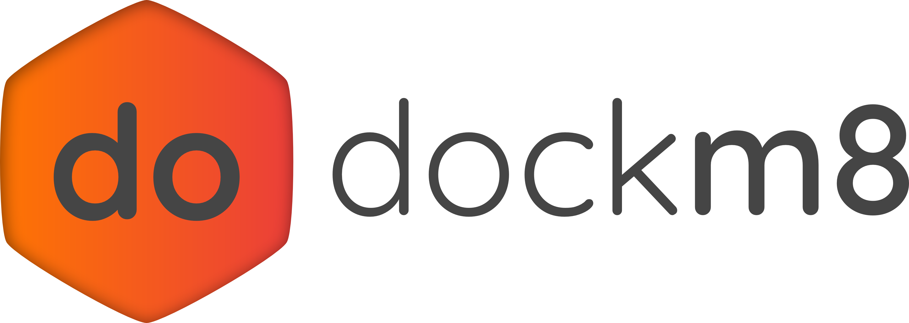

[](https://github.com/DrugBud-Suite/DockM8)
[](https://github.com/DrugBud-Suite/DockM8)
[](https://github.com/DrugBud-Suite/DockM8)
[](https://github.com/DrugBud-Suite/DockM8/blob/main/LICENSE)
[](https://github.com/DrugBud-Suite/DockM8/pulls)
[](https://github.com/DrugBud-Suite/DockM8)
[](https://github.com/DrugBud-Suite/DockM8)
[](https://github.com/DrugBud-Suite/DockM8/issues)
[](https://github.com/DrugBud-Suite/DockM8/issues)

**DockM8 is an all-in-one Structure-Based Virtual Screening workflow based on the concept of consensus docking. The workflow takes care of library and protein preparation, docking, pose selection, rescoring and ranking. We actively encourage the community to participate in the continued development of DockM8. Please see the [**contribution guide**](https://github.com/DrugBud-Suite/DockM8/blob/main/CONTRIBUTING.md) for details.**

DockM8 only runs on Linux systems. However, we have tested the installation on Windows Subsystem for Linux v2 and using VirtualBox virtual machines.

## Automatic installation (Python 3.10 / Ubuntu 22.04)

For automatic installation, download and run [**setup_py310.sh**](https://github.com/DrugBud-Suite/DockM8/releases/download/v1.1.0/setup_py310.sh) This will create the required conda environment and download the respository if not done already. Make sure the installation script can be executed by running `chmod +x setup_py310.sh` and then `**PATH_TO**/setup_py310.sh`.

After installation, activate the environment with `conda activate dockm8`.

## Manual Installation (Python 3.10 / Ubuntu 22.04)

Please refer to the [**Installation Guide**](https://github.com/DrugBud-Suite/DockM8/blob/main/DockM8_Installation_Guide.pdf) provided.

## Running DockM8 (via streamlit GUI)

DockM8 comes with a simple form-based GUI for ease of use. To launch it, run the following command :

`streamlit run **PATH_TO**/gui.py`

You can click the `localhost` link to access the GUI.

## Running DockM8 (via command-line / dockm8.py script)

Please refer to the [**Usage Guide**](https://github.com/DrugBud-Suite/DockM8/blob/main/DockM8_Usage_Guide.pdf) provided.

## Folder Structure

DockM8 creates organized directory structures based on the workflow mode and library name. The main directory is named `dockm8_{library_name}` where `{library_name}` is derived from your input library file.

### Single Receptor Mode (Virtual Screening Only)
```
dockm8_{library_name}/
├── prepared_receptor.pdb
├── pocket_definition.json
├── library/
│   └── prepared_{library_name}.sdf
├── docking/
│   ├── {docking_program}_docked.sdf
│   └── {docking_program}_busted.sdf      # Optional, if --bust_poses=True
├── selection/
│   └── {selection_method}_selected.sdf
├── rescoring/
│   ├── rescored_poses.sdf
│   └── rescored_poses.csv
├── consensus/
│   └── {consensus_method}_consensus.csv # Optional, if using >1 scoring function
└── final_results/
    ├── final_results_with_consensus.sdf     # If consensus scoring was used
    ├── final_results_single_function.sdf    # If a single scoring function was used
```

### Single Receptor Mode with Decoy Optimization
```
dockm8_{library_name}/
├── prepared_receptor.pdb
├── pocket_definition.json
│
├── decoy_optimization/  # Optional, if --generate_decoys=True
│   ├── decoys/
│   │   └── {actives_name}_decoys.sdf
│   ├── library/
│   │   └── prepared_{actives_name}_decoys.sdf
│   ├── docking/
│   │   └── {docking_program}/
│   │       ├── {docking_program}_docked.sdf
│   │       └── {docking_program}_busted.sdf
│   ├── pose_selection/
│   │   └── {docking_program}/
│   │       └── {selection_method}/
│   │           └── {selection_method}_selected.sdf
│   ├── rescoring/
│   │   └── {docking_program}/
│   │       └── {selection_method}/
│   │           ├── rescored_poses.sdf
│   │           └── rescored_poses.csv
│   └── performance/
│       ├── activity_data.csv
│       ├── all_performance_results.csv
│       ├── optimal_parameters.json
│       └── {docking_program}_{selection_method}_performance.csv
│
├── library/
│   └── prepared_{library_name}.sdf
├── docking/
│   ├── {docking_program}_docked.sdf
│   └── {docking_program}_busted.sdf      # Optional, if --bust_poses=True
├── selection/
│   └── {selection_method}_selected.sdf
├── rescoring/
│   ├── rescored_poses.sdf
│   └── rescored_poses.csv
├── consensus/
│   └── {consensus_method}_consensus.csv # Optional, if using >1 scoring function
└── final_results/
    ├── final_results_with_consensus.sdf     # If consensus scoring was used
    ├── final_results_single_function.sdf    # If a single scoring function was used
```

### Ensemble Mode (Multiple Receptors)
```
dockm8_{library_name}/
├── library/
│   └── prepared_{library_name}.sdf
├── receptor_1/
│   ├── prepared_receptor.pdb
│   ├── pocket_definition.json
│   ├── docking/
│   │   ├── {docking_program}_docked.sdf
│   │   └── {docking_program}_busted.sdf  # Optional, if --bust_poses=True
│   ├── selection/
│   │   └── {selection_method}_selected.sdf
│   ├── rescoring/
│   │   ├── rescored_poses.sdf
│   │   └── rescored_poses.csv
│   └── consensus/
│       └── {consensus_method}_consensus.csv # Optional, if using >1 scoring function
├── receptor_2/
│   ├── prepared_receptor.pdb
│   ├── pocket_definition.json
│   ├── docking/
│   │   ├── {docking_program}_docked.sdf
│   │   └── {docking_program}_busted.sdf  # Optional, if --bust_poses=True
│   ├── selection/
│   │   └── {selection_method}_selected.sdf
│   ├── rescoring/
│   │   ├── rescored_poses.sdf
│   │   └── rescored_poses.csv
│   └── consensus/
│       └── {consensus_method}_consensus.csv # Optional, if using >1 scoring function
└── final_results/
    └── final_ensemble_results.csv
```

### Directory Description
- **prepared_receptor.pdb**: Processed and prepared protein structure
- **pocket_definition.json**: Binding site definition and parameters
- **library/**: Contains prepared compound libraries
- **docking/**: Docking results from specified programs
- **selection/**: Selected poses using specified methods
- **rescoring/**: Rescored poses with various scoring functions
- **consensus/**: Consensus scoring results (when multiple functions are used)
- **final_results/**: Final ranked results for virtual screening
- **decoy_optimization/**: Parameter optimization results (when decoy generation is enabled)
- **receptor_N/**: Individual receptor results in ensemble mode

## Running DockM8 (via Jupyter Notebook)

1. Open dockm8.ipynb, dockm8_ensemble.ipynb or dockm8_decoys.ipynb in your favorite IDE, depending on which DockM8 mode you want to use.

2. Follow the instructions in the Markdown cells

## Reproducing Benchmark Results

The `analysis/` directory contains everything needed to reproduce all figures from the DockM8 paper: download/extraction scripts, analysis pipeline, and committed literature baselines.

```bash
# Quick start (3 commands from project root):
python -m analysis.extract_zenodo /path/to/downloads /path/to/dockm8_data
python -m analysis.run_all all --base-path /path/to/dockm8_data
```

See [analysis/README.md](analysis/README.md) for complete instructions including download links, archive contents, per-step commands, and output reference.

## Issues and bug reports

Please use the [issue system](https://github.com/DrugBud-Suite/DockM8/issues) built into github to report issues. They will be resolved as soon as possible.

## Acknowledgements

This project is a collaboration between the [Volkamer](https://volkamerlab.org/) and [Hirsch](https://www.helmholtz-hips.de/en/research/teams/team/drug-design-and-optimisation/) labs.

We acknowledge and thank the authors of the various packages used in DockM8. Please see the publication for citations.

## Citation

If you use DockM8 in your research, please cite:

> TODO: Citation will be added upon publication.

## License

This project is licensed under the GNU GPL v3.0 License - see the [LICENSE](https://github.com/DrugBud-Suite/DockM8/blob/main/LICENSE) file for details.

## Contributing

We highly encourage contributions from the community - see the [CONTRIBUTING.md](https://github.com/DrugBud-Suite/DockM8/blob/main/CONTRIBUTING.md) file for details.
