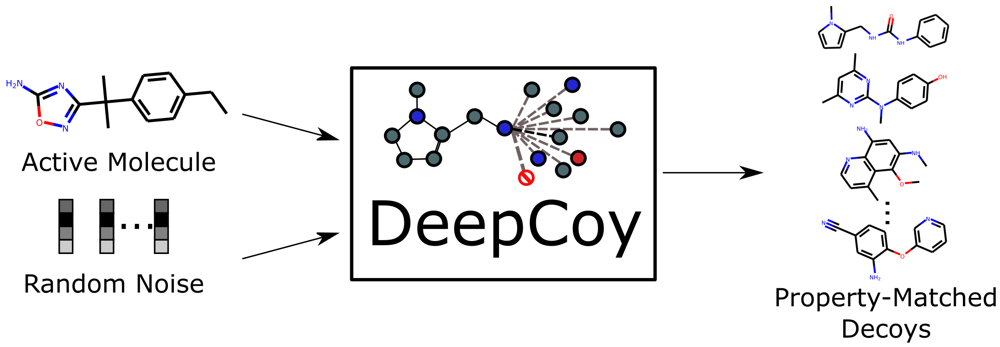

# DeepCoy - Generating Property-Matched Decoy Molecules Using Deep Learning



This repository contains our implementation of [Generating Property-Matched Decoy Molecules Using Deep Learning](https://doi.org/10.1093/bioinformatics/btab080) (DeepCoy). 

If you found DeepCoy useful, please cite our paper:

Imrie F, Bradley AR, Deane CM. Generating property-matched decoy molecules using deep learning. Bioinformatics. 2021

```
@article{Imrie2021DeepCoy,
    author = {Imrie, Fergus and Bradley, Anthony R and Deane, Charlotte M},
    title = "{Generating property-matched decoy molecules using deep learning}",
    journal = {Bioinformatics},
    year = {2021},
    month = {02},
    issn = {1367-4803},
    doi = {10.1093/bioinformatics/btab080},
    url = {https://doi.org/10.1093/bioinformatics/btab080},
    eprint = {https://academic.oup.com/bioinformatics/advance-article-pdf/doi/10.1093/bioinformatics/btab080/36297301/btab080.pdf},
}
```

# Acknowledgements

We thank the authors of [Constrained Graph Variational Autoencoders for Molecule Design](https://papers.nips.cc/paper/8005-constrained-graph-variational-autoencoders-for-molecule-design) for releasing their code. The code in this repository is based on their source code release ([link](https://github.com/microsoft/constrained-graph-variational-autoencoder)). If you find this code useful, please consider citing their work.

# Requirements

This code was tested in Python 3.6 with Tensorflow 1.10. 

A yaml file containing all install requirements is provided. This can be readily setup using conda.

```
conda env create -f DeepCoy-env.yml
conda activate DeepCoy-env
```

To run our model using subgraph reweighted loss function, you need to download the subgraph frequency data from [http://opig.stats.ox.ac.uk/resources](http://opig.stats.ox.ac.uk/resources). Note this is not required for generating molecules using pretrained models but is advised for training new models.

# Data Extraction

We have prepared two training datasets based on different physicochemical properties. Both were created from a subset of the ZINC dataset.

To preprocess these datasets, please go to `data` directory and run `prepare_data.py`.

```
python prepare_data.py
```

# Running DeepCoy

To train and generate molecules using DeepCoy, use:

```
python DeepCoy.py --dataset zinc --config '{"number_of_generation_per_valid": 100, "num_epochs": 10, "epoch_to_generate": 10, "train_file": "data/molecules_zinc_dekois_train.json", "valid_file": "data/molecules_zinc_dekois_valid.json", "subgraph_freq_file": "./freq_dict_zinc_250k_smarts.pkl"}'
```

To train and generate molecules using DeepCoy without the subgraph reweighted loss function, use:
```
python DeepCoy.py --dataset zinc --config '{"number_of_generation_per_valid": 100, "num_epochs": 10, "epoch_to_generate": 10, "train_file": "data/molecules_zinc_dekois_train.json", "valid_file": "data/molecules_zinc_dekois_valid.json", "use_subgraph_freq": false}'
```

To generate molecules with a pretrained model, use

```
python DeepCoy.py --restore models/DeepCoy_DUDE_model_e09.pickle --dataset zinc --config '{"generation": true, "number_of_generation_per_valid": 1000, "batch_size": 1, "train_file": "data/molecules_zinc_dekois_valid.json", "valid_file": "data/molecules_zinc_dekois_valid.json", "output_name": "output/DeepCoy_generated_decoys_zinc_dekois_valid.txt"}'
```

The output is of the following format:

```
Input molecule (SMILES) Generated molecule (SMILES)
```

More configurations can be found at function `default_params` in `DeepCoy.py`.

# Evaluation

A script to evaluate the generated molecules and prepare a set of decoys is provided in `evaluation` directory. You can either specify a one file or a directory containing multiple files to process.

```
python select_and_evaluate_decoys.py --data_path PATH_TO_INPUT_FILE/DIRECTORY --output_path PATH_TO_OUTPUT --dataset_name dude --num_decoys_per_active 50 >> decoy_selection_log.txt
```

The input format should be of the following format:
```
Active molecule (SMILES) Possible decoy molecule (SMILES)
```

# Pretrained Models and Generated Molecules

We provide two pretrained models based on different physicochemical properties (as described in our paper). 

Due to GitHub file size constraints, these need to be downloaded from [http://opig.stats.ox.ac.uk/resources](http://opig.stats.ox.ac.uk/resources):

```
models/DeepCoy_DUDE_model_e09.pickle
models/DeepCoy_DEKOIS_model_e10.pickle
```

In addition, we provide a model that incorporates phosphorus:
```
models/DeepCoy_DUDE_phosphorus_model_e10.pickle
```

Generated molecules can also be downloaded from the [OPIG website](http://opig.stats.ox.ac.uk/resources).

# Examples

An example Jupyter notbook demonstrating the use of DeepCoy to generate and select decoy molecule can be found in the `examples` directory.

# Contact (Questions/Bugs/Requests)

Please submit a Github issue or contact either Fergus Imrie or the Oxford Protein Informatics Group (OPIG) [deane@stats.ox.ac.uk](mailto:deane@stats.ox.ac.uk).
